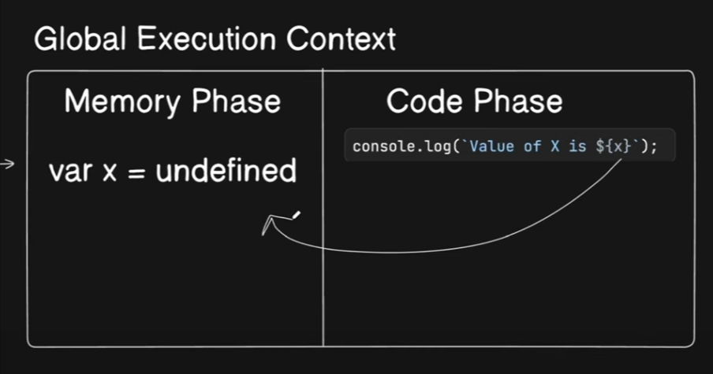
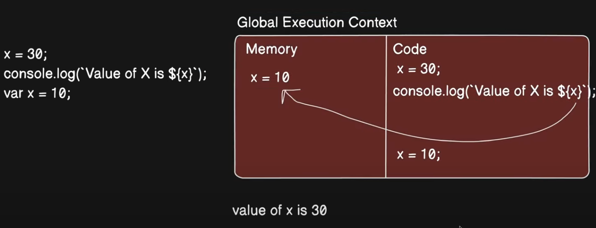
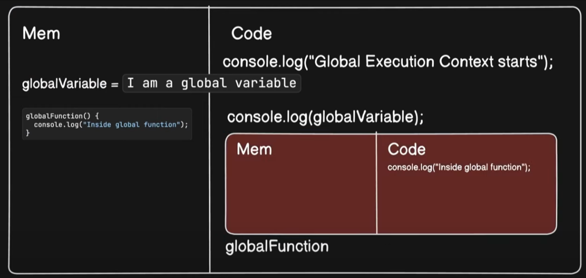
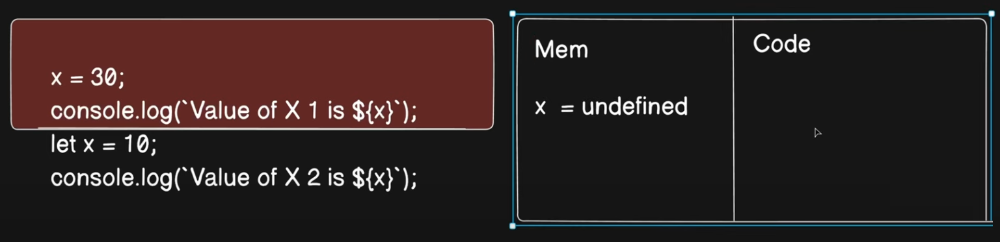

# Hoisting

## Question 1

```
console.log(`Value of X is ${x}`);

var x = 10
```

Output:

```
Value of X is undefined
```



## Question 2

```
x = 20

console.log(`Value of X is ${x}`);

var x = 10
```

Output: 

```
Value of X is 20
```



## Question 3

```
console.log ("Global Execution Context starts");

var globalVariable = "I am a global variable";

function globalFunction() {
  console.log ("Inside global function");
}

console.log (globalVariable);
globalFunction ();

console.log ("Global Execution Context ends");
```

Output: 

```
Global Execution Context starts
I am a global variable
Inside global function
Global Execution Context ends
```



## Question 4

```
console.log ("Global Execution Context starts");

var globalVariable = "I am a global variable";

console.log (globalVariable);
globalFunction ();

console.log ("Global Execution Context ends");

function globalFunction() {
  console.log ("Inside global function");
}
```

Output:

```
Global Execution Context starts
I am a global variable
Inside global function
Global Execution Context ends
```

## Question 5

```
console.log ("Global Execution Context starts");

var globalVariable = "I am a global variable";

console.log (globalVariable);
globalFunction (); // Here we are trying to call "undefined". In memory phase var globalFunction = undefined.

console.log ("Global Execution Context ends");

var globalFunction = function() {
  console.log ("Inside global function");
}
```

Output:

```
Uncaugth TyperError: globalFunction is not a function at line no..
```

## Question 6

```
console.log("Start of script 2");

setTimeout(() => {
  console.log("This is from the Task Queue (setTimeOut)");
}, 0);

console.log("End of script");
```

Output:

```
Start of script 2
End of script
This is from the Task Queue (setTimeOut)
```

## Temporal Dead Zone (TDZ)

* var = Hoist? YES
* let = Hoist? YES

* const = Hoist? YES

=> Let and Const creates Temporal Dead Zone.

### Question

```
x = 20

console.log(`Value of X is ${x}`);

let x = 10;

console.log(`Value of X is ${x}`);
```

Output:

```
Uncaught ReferenceError: Cannot access 'x' before initialization at line..
```


